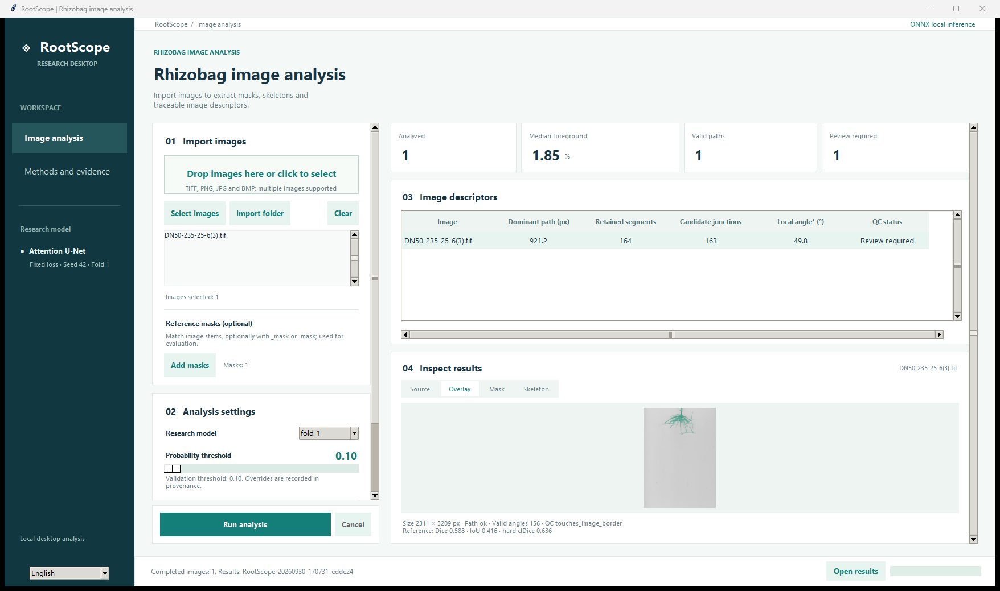

# RootScope Desktop

RootScope segments rhizobag root images and extracts skeleton-derived image descriptors. This repository accompanies **Automated segmentation and skeleton-derived root descriptors in rhizobag seedling images: a controlled evaluation of Attention U-Net**. It contains a native Tkinter interface, a batch command, five frozen ONNX models and the study's numerical evidence.

**Version 1.1.0** — [Download the Windows application, source and numerical records](https://github.com/goldriderhszz-hash/root-phenotyping-attunet/releases/tag/v1.1.0). [Release information](docs/RELEASE_STATUS.md) describes the assets and verification scope.

[English guide](docs/USER_GUIDE.md) · [中文说明](docs/USER_GUIDE.zh-CN.md) · [Reproduce the paper](docs/REPRODUCIBILITY.md) · [Models](MODEL.md) · [Data availability](DATA_AVAILABILITY.md) · [Citation](CITATION.md)



The example uses the seed-42 out-of-fold image whose deployment Dice is closest to the 50-image median, with its own held-out fold model and validation threshold. It illustrates operation and is not external validation or best-case selection.

## Availability and requirements

| Item | Specification |
| --- | --- |
| Project | RootScope Desktop |
| Home | [root-phenotyping-attunet](https://github.com/goldriderhszz-hash/root-phenotyping-attunet) |
| Package | Windows x64; extract the entire folder; no Python or GPU installation required |
| Source | Python 3.12, Tk 8.6 and pinned `requirements.txt` dependencies |
| Interface | English on first use; Chinese switch; locally retained selection |
| Computation | Local inference; network unnecessary for image analysis |
| License | MIT software; research-data permissions are documented separately |
| Verification | Windows desktop checks; automated source tests are defined for Windows, Linux and macOS |

The package targets Windows 10/11 x64. Testing on one Windows 11 computer does not establish a measured minimum RAM/CPU requirement. Large TIFFs require more time and memory than the installation example. [Validation](validation/README.md) distinguishes CPU deployment timing from the original GPU experiment.

## Windows quick start

1. Extract `RootScope-Desktop-Windows-x64.zip`, keeping `RootScope.exe` and `_internal` together.
2. Open the EXE. Choose **Select images** or **Import folder**, or drag in images/folders.
3. Select `fold_0` through `fold_4`; the corresponding validation-selected threshold loads automatically.
4. Optionally add matching reference masks, choose an output directory and click **Run analysis**.
5. Select a result row and inspect **Source**, **Overlay**, **Mask** and **Skeleton**. Choose **Open results** for exports.

Choose **中文** while idle to switch language. Inputs, settings, selected layers and results are retained. Small windows have scrollbars for settings, results and table columns. Windows file dialogs follow the operating system language.

## Run from source or command line

```powershell
python -m venv .venv
.venv\Scripts\python -m pip install -r requirements.txt
.venv\Scripts\python desktop.py
.venv\Scripts\python cli.py image-folder --output result-folder --model fold_0
.venv\Scripts\python cli.py examples\synthetic_root.png --references examples\synthetic_root_mask.png --output demo-results --no-zip
```

Use `.venv/bin/python` on macOS/Linux and install OS-provided Tk if absent. Source is designed for cross-platform Python/Tk; each native binary must be built on its target OS.

```powershell
RootScope.exe --batch image.tif --output result-folder --model fold_2 --no-zip
```

Options include `--references`, `--threshold`, `--save-probability`, `--language en|zh` and `--no-zip`. The windowed EXE has no console progress; wait for process completion before reading results. The synthetic example tests installation/output, not biological accuracy.

## Methods and interpretation

Grayscale images receive CLAHE (clip 2.0; 16 × 16 grid), [0,1] normalization, 256 × 256 tiling with stride 128, reflection padding and Gaussian fusion (sigma 64). The five seed-42 fixed-loss Attention U-Net checkpoints are used individually, with thresholds 0.47, 0.10, 0.82, 0.10 and 0.89. No ensemble is formed. For study reproduction each image must use its own test-fold model, not simply the application's fold-0 default.

| Field | Meaning |
| --- | --- |
| `dominant_path_length` | Weighted path on the selected raw-skeleton component, pixels; not total or validated primary-root length |
| `retained_segment_count` | Components after closing 5, pruning 15 and minimum size 10; not anatomical lateral-root count |
| `junction_region_count` | Candidate regions in processed skeleton; may include contacts and crossings |
| `mean_local_acute_angle_deg` | Exploratory local acute angle; coordinate-order-dependent; not validated emergence angle |

The study contains 50 distinct images, four configurations, five folds and three seeds: 60 fits and 600 out-of-fold prediction records. Fixed skeleton loss improved mean Dice by 2.53 percentage points over pixel-loss Attention U-Net, while segment and junction-region MAEs increased by 35.03 and 50.05. Higher overlap does not establish descriptor reliability. Plant/batch independence and physical scale are unverified; outcomes describe internal image-level performance.

**No flags** means no implemented QC check raised a flag; it does not establish accuracy. **Review required** requests inspection; the software does not automatically repair masks or approve measurements.

## Outputs

```text
RootScope_<timestamp>_<id>/
  results.csv                 stable English scientific columns
  results.json                nested per-image results
  errors.csv                  per-image failures
  provenance.json             hashes, model, threshold, settings and versions
  images/<image-id>/prediction_mask.png
  images/<image-id>/overlay.png
  images/<image-id>/skeleton.png
  images/<image-id>/*_preview.*
  RootScope_<timestamp>_<id>_results.zip
```

Probability maps are optionally saved as `probability_float32.npz`. References use white roots (255), black background (0), matching dimensions and the image stem with optional `_mask`/`-mask`. References enter evaluation, not inference. File names/paths may contain Chinese; scientific columns, units, model IDs and machine codes remain stable. See [schema](docs/OUTPUT_SCHEMA.md) and [troubleshooting](docs/TROUBLESHOOTING.md).

## Paper reproduction and verification

```powershell
python -m pip install -r requirements-analysis.txt
python analysis/reproduce_tables.py --output analysis/generated
python analysis/angle_geometry_audit.py
python analysis/audit_uncertainty.py
python analysis/source_denominators.py
python analysis/make_descriptor_figures.py
python -m unittest discover -s tests -v
python desktop.py --self-test model-check.json
```

Included numeric records support audit and table/figure regeneration without training. Recomputing from masks requires access to the original research assets; see [data availability](DATA_AVAILABILITY.md). [Reproducibility](docs/REPRODUCIBILITY.md) states each tier's inputs, outputs and limits. [Limitations](docs/LIMITATIONS.md) documents uncertainty and descriptor interpretation.

## Repository map

| Directory | Contents |
| --- | --- |
| `rootscope/` | Shared numerical pipeline, model selection and translations |
| `model/` | Five ONNX graphs, hashes and conversion records |
| `research/` | Protocol, split metadata and all 60 run records |
| `analysis/` | Three-seed numeric evidence, portable analysis and figure scripts |
| `validation/` | Historical deployment and version-specific checks |
| `examples/` | Synthetic input, reference and expected output |
| `docs/` | Guides, schema, reproduction, limits and release status |
| `manuscript/` | Final figure assets, caption/hash manifest and generation scope |
| `tests/`, `scripts/` | Behavioral checks, validation, timing and packaging |

Report software version, release tag or commit, fold model, hash and threshold. [CITATION.cff](CITATION.cff) describes this software; the manuscript is unpublished. Issue reports should include version, OS, dimensions, model, threshold and a minimal permitted example. See [CONTRIBUTING.md](CONTRIBUTING.md).
