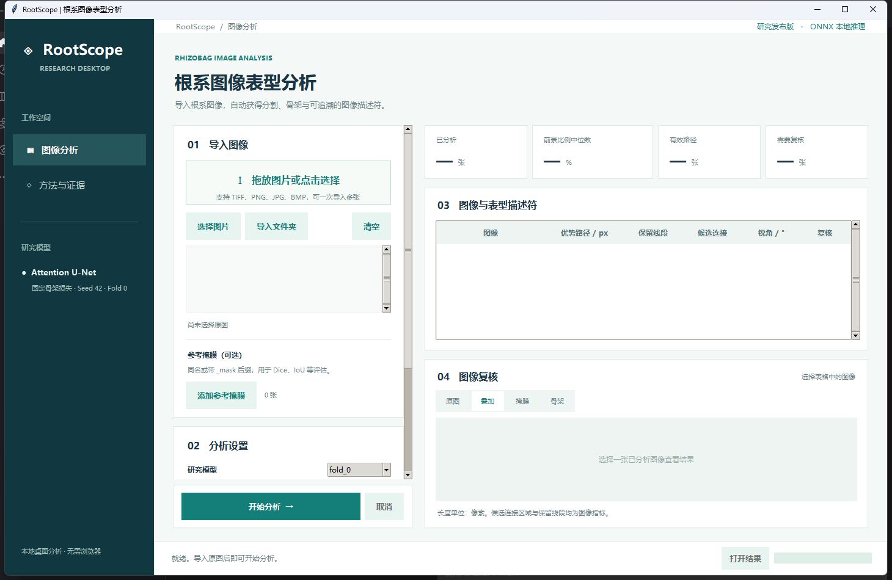

# RootScope Desktop

**A native desktop application for rhizobag root image segmentation and skeleton-derived image descriptors.** It opens as a normal Windows program; it does not start a web server or require a browser. The source code can also run on macOS or Linux with Python 3.12, Tk, and the listed dependencies.

**中文速览：** 下载 Windows 发布包后解压整个 `RootScope` 文件夹，双击其中的 `RootScope.exe`。导入一张或多张根系图像，按需加入同名参考掩膜，点击“开始分析”。软件会生成分割掩膜、叠加图、骨架图、描述符 CSV、JSON 和结果压缩包。首次运行和较大图像的分析需要一些时间；所有计算在本机完成。



The screenshot shows the initial empty workspace; no example image or result is implied.

This repository publishes one fixed research release. Use the `research-release` tag and its commit hash to identify the exact software in a paper or analysis record.

## Windows download and launch

1. Download `RootScope-Desktop-Windows-x64.zip` from the [single research release](https://github.com/goldriderhszz-hash/root-phenotyping-attunet/releases/tag/research-release).
2. Extract the whole archive. Keep `RootScope.exe` and its `_internal` folder together.
3. Double-click `RootScope.exe`. No Python installation is required for this packaged build.
4. Click **选择图片** or **导入文件夹**, select one of five fold models if needed, optionally **添加参考掩膜**, choose the result directory, and click **开始分析**.
5. Select a row to inspect the source, overlay, mask, and skeleton. Click **打开结果** to see exported files.

The Windows ZIP contains the complete executable directory. It is not an installer. If Windows displays a trust prompt for an unsigned download, inspect the source and release provenance before deciding whether to run it.

The packaged EXE can also run unattended without installing Python:

```powershell
RootScope.exe --batch path\to\image.tif --references path\to\image_mask.png --output path\to\results --model fold_0 --no-zip
```

The batch command writes the same results and provenance as the GUI; the `--windowed` binary does not show terminal progress. Wait for `results.csv` and `provenance.json` in the new output folder before using its outputs.

## Run from source

Python 3.12 and Tk 8.6 are required. On Linux, install your distribution's `python3-tk` package first.

```powershell
python -m venv .venv
.venv\Scripts\python -m pip install -r requirements.txt
.venv\Scripts\python desktop.py
```

macOS and Linux use `.venv/bin/python` instead of `.venv\Scripts\python`.

For batch automation:

```powershell
.venv\Scripts\python cli.py path\to\images --references path\to\masks --output path\to\results --model fold_0
```

The `--model` option accepts `fold_0` through `fold_4`. Each uses its own validation-selected threshold by default; `--threshold` overrides it and is written to provenance. Other options include `--save-probability` and `--no-zip`. A single image path or a directory of images can be supplied. Reference files match the image stem exactly or with `_mask` / `-mask` appended. Supported inputs are TIFF, PNG, JPG, and BMP. The GUI and CLI use the same analysis code.

## Scientific method

The release includes **all five seed-42 fold checkpoints** for the manuscript's fixed skeleton-loss Attention U-Net, exported to ONNX. Each checkpoint was trained on 30 images, selected and thresholded using 10 separate validation images, and evaluated only on its 10 held-out test images. The desktop default is `fold_0`; selecting a model is explicit and no ensemble is formed. The locked thresholds are 0.47, 0.10, 0.82, 0.10, and 0.89 for folds 0–4. Images are converted to grayscale, enhanced with CLAHE (clip limit 2.0, 16 × 16 grid), normalized to [0, 1], predicted in 256 × 256 tiles with 128 pixel stride, and fused with a Gaussian weight window (σ = 64). The packaged Windows build uses CPU inference. Model provenance and SHA-256 values are in [MODEL.md](MODEL.md).

Four primary descriptors are exported:

| Column | Meaning |
| --- | --- |
| `dominant_path_length` | Weighted path length on the raw predicted skeleton, in pixels. |
| `retained_segment_count` | Count of retained skeleton segments after 5 × 5 closing and 15 pruning iterations; minimum segment size 10 pixels. |
| `junction_region_count` | Count of candidate junction regions in the processed skeleton. |
| `mean_local_acute_angle_deg` | Mean local acute angle where a valid angle can be estimated. |

Additional fields include image dimensions, foreground fraction, descriptor status, QC flags, threshold, and SHA-256 hashes. If matching reference masks are supplied, RootScope adds Precision, Recall, Dice/F1, IoU, hard clDice, width-stratified centerline recall, reference descriptors, and predicted-minus-reference differences.

These values are **image-derived descriptors in pixel space**. Dominant path length is not total root length or an independently validated anatomical primary root length. Retained segments, candidate junctions, and local angles must not be interpreted directly as true lateral roots, branch points, or emergence angles. No physical scale is assumed. The study's aggregate cross-validation results estimate the fold-wise pipeline, not the accuracy of any one checkpoint on arbitrary new images. Performance under different species or imaging conditions needs external validation.

## Output

Every run creates `RootScope_<timestamp>_<id>/` under the chosen output directory:

```text
results.csv
results.json
errors.csv
provenance.json
images/<image-id>/prediction_mask.png
images/<image-id>/overlay.png
images/<image-id>/skeleton.png
images/<image-id>/*_preview.*
RootScope_<timestamp>_<id>_results.zip
```

When **同时保存 float32 概率图** is selected, each image directory also contains `probability_float32.npz`. `provenance.json` records the model, threshold, preprocessing, inference settings, library versions, input hashes, result count, and errors. `errors.csv` records per-image failures while the batch continues. Cancellation takes effect after the current image.

## Verification and builds

```powershell
.venv\Scripts\python -m unittest discover -s tests -v
.venv\Scripts\python desktop.py --self-test self-test.json
```

The self-test checks all five bundled ONNX hashes, loads each model, and runs a 256 × 256 prediction. To build a Windows ZIP from source, install `requirements-build.txt` and run `scripts/build_windows.ps1`. Native binaries must be built on their target operating system. GitHub Actions runs the tests, packages the Windows application, and attaches the ZIP to the `research-release` tag.

The published `model/` directory contains five inference-ready ONNX graphs and `catalog.json`. Training checkpoints are identified by SHA-256 in the catalog and can be re-exported using `scripts/export_fold_models.py` when those original study artifacts are available. They are not required to run the desktop application.

## Validation and comparison

- [Full-image deployment validation](validation/README.md) runs the released ONNX application pipeline on each fold's ten held-out images, yielding 50 out-of-fold results. It reports image-level and pooled segmentation metrics, descriptor outputs, per-image model hashes, and parity with the original research pipeline. This is internal validation; it is not an independent external cohort.
- [Direct software comparison](benchmark/README.md) runs the official RhizoVision Explorer 2.0.3 binary on the same fold-0 test images. Its threshold was selected on fold 1, the validation set for RootScope fold 0. On ten held-out images, macro Dice was 0.59845 for RootScope and 0.47626 for RhizoVision Explorer; the paired mean difference was 0.12219, with a 95% image-bootstrap interval of 0.07519–0.18695. The software serves different acquisition settings, so the comparison describes this rhizobag dataset only.
- [Research protocol and training code](research/README.md) include fold assignments, image-hash manifest, architecture, loss, checkpoint selection, and aggregation scripts. Raw images and annotations are not included in this software repository yet; paths to them are supplied locally for validation.

These evidence files report results actually produced by the binaries and scripts. Do not substitute the manuscript's three-seed aggregate scores for this released five-model package.

## Availability and requirements

| Item | Value |
| --- | --- |
| Project name | RootScope Desktop |
| Project home page | https://github.com/goldriderhszz-hash/root-phenotyping-attunet |
| Operating systems | Windows 10/11 x64 binary; Python 3.12 source on Windows, macOS, or Linux with Tk 8.6 |
| Programming language | Python 3.12; five ONNX model graphs |
| Other requirements | Windows binary: no Python or internet during use. Source: `requirements.txt` and Tk. |
| License | MIT for RootScope source and supplied ONNX models; third-party components retain their licenses. |
| Non-academic restrictions | None under the MIT License. |

## License and citation

The RootScope source code and supplied model files are released under the [MIT License](LICENSE). Bundled third-party libraries retain their own licenses. For publications, describe the `research-release` tag or its exact commit, selected model/fold, threshold, and any manual reference masks, and cite the associated manuscript when bibliographic details are available. See [CITATION.md](CITATION.md).
